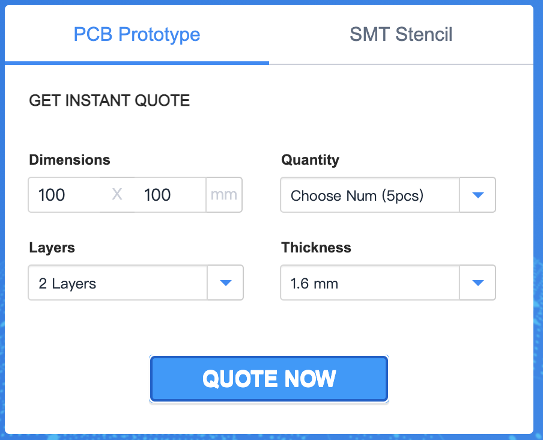
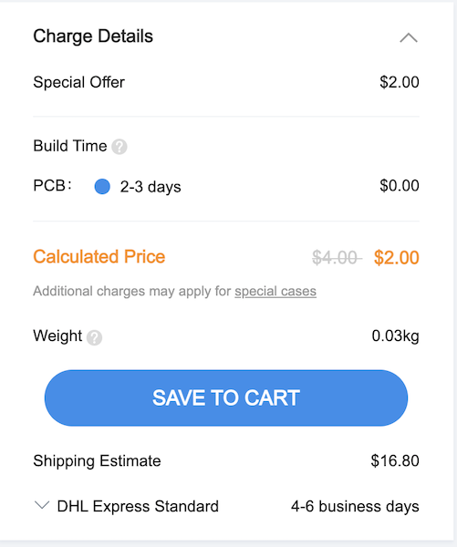

# Assembly guide

In this document, I will go through all the steps and explain everything needed to make a complete Touché system.

The total cost of the system sits somewhere around **50 euros** but since most parts are sold in batch you might pay a little more and end up with unused parts at the end of the assembly.

#### Table of Contents

1. [Parts, material and required tools](#p1)
2. [PCB](#p2)
3. [3D printing](#p3)
4. [Assembly](#p4)
5. [Testing / Usage](#p5)

<a name="p1"/>

### 1. Parts, material, and required tools

##### Here are all the parts required.

| Name                                          | Quantity | URL  |
| --------------------------------------------- | -------- | ---- |
| Arduino nano                                  | 3        | [Aliexpress](https://fr.aliexpress.com/item/32647196840.html?spm=a2g0o.productlist.0.0.54bf557doXKYBm&algo_pvid=2dafda83-8817-4a5d-9a19-fa4c728a5307&algo_expid=2dafda83-8817-4a5d-9a19-fa4c728a5307-0&btsid=2100bdec16164048649457162ec18e&ws_ab_test=searchweb0_0,searchweb201602_,searchweb201603_) [Arduino store](https://store.arduino.cc/arduino-nano) [Amazon](https://www.amazon.fr/Elegoo-Pi%C3%A8ces-ATmega328P-Contr%C3%B4leur-Arduino/dp/B0722YYBSS/ref=sr_1_5?__mk_fr_FR=%C3%85M%C3%85%C5%BD%C3%95%C3%91&dchild=1&keywords=arduino+nano&qid=1616404940&sr=8-5) |
| NRF24L01                                      | 3        | [Aliexpress](https://fr.aliexpress.com/item/32517849393.html?spm=a2g0o.productlist.0.0.7052156e1u6EWG&algo_pvid=22320d44-49fd-4c5b-8917-0aec425791c5&algo_expid=22320d44-49fd-4c5b-8917-0aec425791c5-0&btsid=2100bdec16164050216182977ec18e&ws_ab_test=searchweb0_0,searchweb201602_,searchweb201603_) [Amazon](https://www.amazon.fr/AZDelivery-NRF24L01-Antenne-emetteur-recepteur-R%C3%A9cepteur/dp/B06XJN417D/ref=sr_1_7?__mk_fr_FR=%C3%85M%C3%85%C5%BD%C3%95%C3%91&dchild=1&keywords=nrf24l01&qid=1616405051&sr=8-7) |
| AA battery case                               | 3        | [Aliexpress](https://fr.aliexpress.com/item/1005001707889794.html?spm=a2g0o.productlist.0.0.4a7250f2xvurNo&algo_pvid=09dbf49a-a358-43e9-8fb5-643cd7c1323b&algo_expid=09dbf49a-a358-43e9-8fb5-643cd7c1323b-0&btsid=2100bdec16164051545004908ec18e&ws_ab_test=searchweb0_0,searchweb201602_,searchweb201603_) [Amazon](https://www.amazon.fr/HUAYAO-Batterie-Plastique-Stockage-Transparent/dp/B08VDHCD66/ref=sr_1_8?__mk_fr_FR=%C3%85M%C3%85%C5%BD%C3%95%C3%91&dchild=1&keywords=3+AA+battery+case&qid=1616405113&sr=8-8) |
| 10uF 16v electrolytic capacitor               | 3        | [Aliexpress](https://fr.aliexpress.com/item/32812085542.html?spm=a2g0o.cart.0.0.3a7f3c00e96C79&mp=1) |
| RGB led (common cathode)                      | 2        | [Aliexpress](https://fr.aliexpress.com/item/32757977782.html?spm=a2g0o.productlist.0.0.3fe47c00Zn99Co&algo_pvid=b4ef31d6-d214-46bb-bef0-ac81c41d9967&algo_expid=b4ef31d6-d214-46bb-bef0-ac81c41d9967-0&btsid=0b0a187916200811598005049e1326&ws_ab_test=searchweb0_0,searchweb201602_,searchweb201603_) |
| Neopixel ring (12 pixels, 50 mm diameter)     | 2        | [Aliexpress](https://fr.aliexpress.com/item/32835427711.html?spm=a2g0s.9042311.0.0.27426c37UHtlV5) |
| Banana socket                                 | 6        | [Aliexpress](https://fr.aliexpress.com/item/32871913429.html?spm=a2g0o.productlist.0.0.717377a1QiWSxl&algo_pvid=1f3db05d-7783-4ff9-8da5-87ac7512a254&algo_expid=1f3db05d-7783-4ff9-8da5-87ac7512a254-3&btsid=0b0a187916200812276135080e1326&ws_ab_test=searchweb0_0,searchweb201602_,searchweb201603_) |
| Slide switch                                  | 3        | [Aliexpress](https://fr.aliexpress.com/item/32807468914.html?spm=a2g0o.productlist.0.0.2ea1efebRmneNM&algo_pvid=36c82aba-d689-49ea-ad36-39383b8dd7a9&algo_expid=36c82aba-d689-49ea-ad36-39383b8dd7a9-3&btsid=2100bdec16164056564492872ec18e&ws_ab_test=searchweb0_0,searchweb201602_,searchweb201603_) [Amazon](https://www.amazon.fr/Lezed-Interrupteur-Horizontal-commutateur-horizontal/dp/B07LBPDB6S/ref=sr_1_33?__mk_fr_FR=%C3%85M%C3%85%C5%BD%C3%95%C3%91&dchild=1&keywords=switch+button&qid=1616405594&sr=8-33) |
| Threaded inserts (M3 x 5,7mm)                 | 12       | [Aliexpress](https://fr.aliexpress.com/item/4001258499799.html?spm=a2g0o.productlist.0.0.612f7dbbvz6kTJ&algo_pvid=baed550c-1ba2-4479-8cc2-1377f3ba6714&algo_expid=baed550c-1ba2-4479-8cc2-1377f3ba6714-2&btsid=2100bdec16164057395673206ec18e&ws_ab_test=searchweb0_0,searchweb201602_,searchweb201603_) |
| 1MΩ resistor                                  | 6        | Full ressistor Kit [Amazon](https://www.amazon.fr/ELEGOO-R%C3%A9sistance-Electroniques-Exp%C3%A9rimentalur-Exp%C3%A9rimental/dp/B071LHFQKD/ref=sr_1_5?__mk_fr_FR=%C3%85M%C3%85%C5%BD%C3%95%C3%91&crid=327NRMDKWZ3TP&dchild=1&keywords=resistor+kit&qid=1616405873&sprefix=resistor%2Caps%2C164&sr=8-5) [Aliexpress](https://fr.aliexpress.com/item/1005001968824337.html?spm=a2g0o.productlist.0.0.746b3f8c0Y2Mhn&algo_pvid=f9607bec-0de2-428e-a303-aaa761708253&algo_expid=f9607bec-0de2-428e-a303-aaa761708253-0&btsid=2100bdec16164059394684677ec18e&ws_ab_test=searchweb0_0,searchweb201602_,searchweb201603_)    |
| 10 KΩ resistor                                | 2        | Same ressistor Kit |
| 0 Ω resistor                                  | 2        | Same ressistor Kit |
| 220 Ω resistor                                | 6        | Same ressistor Kit |
| Buzzer SFM-27                                 | 1        | [Aliexpress](https://fr.aliexpress.com/item/1005002095783515.html?spm=a2g0o.productlist.0.0.a9add4abscUyMV&algo_pvid=d7001577-bf5f-497d-9e5e-af7428784ad3&algo_expid=d7001577-bf5f-497d-9e5e-af7428784ad3-3&btsid=2100bdec16164060163915350ec18e&ws_ab_test=searchweb0_0,searchweb201602_,searchweb201603_) [Amazon](https://www.amazon.fr/YANSHON-Buzzer-dAlarme-Avertisseur-%C3%A9lectronique/dp/B07RY42FQ5/ref=sr_1_1?__mk_fr_FR=%C3%85M%C3%85%C5%BD%C3%95%C3%91&dchild=1&keywords=sfm+27&qid=1616406059&sr=8-1) |
| AA battery                                    | 9        | [Amazon](https://www.amazon.fr/Duracell-Plus-Power-Piles-Alcalines/dp/B005EJFLJC/ref=sr_1_5?__mk_fr_FR=%C3%85M%C3%85%C5%BD%C3%95%C3%91&dchild=1&keywords=aa+battery&qid=1616406100&sr=8-5) or any local store |
| Bolt (M3 x 10)                                | 12       | [Aliexpress](https://fr.aliexpress.com/item/33012853233.html?spm=a2g0o.productlist.0.0.3a3888c1zqhxRF&algo_pvid=5c853c10-dafd-437e-900e-69b52295e526&algo_expid=5c853c10-dafd-437e-900e-69b52295e526-0&btsid=0b0a050b16200820396897562e170e&ws_ab_test=searchweb0_0,searchweb201602_,searchweb201603_) [Amazon](https://www.amazon.fr/100pcs-Boulon-Hexagonale-Cylindrique-inoxydable/dp/B073ZY19VS/ref=sr_1_13?__mk_fr_FR=%C3%85M%C3%85%C5%BD%C3%95%C3%91&dchild=1&keywords=m3+x+10&qid=1620082082&sr=8-13) |
| Mini screws (M1.75 x 5)                       | 12       | [Aliexpress](https://fr.aliexpress.com/item/4000930559532.html?spm=a2g0o.productlist.0.0.761321146ysipd&algo_pvid=0f249ca6-419b-4e43-90a0-ce0ec4231748&algo_expid=0f249ca6-419b-4e43-90a0-ce0ec4231748-1&btsid=0b0a050b16200822461428680e170e&ws_ab_test=searchweb0_0,searchweb201602_,searchweb201603_) [Amazon](https://www.amazon.fr/1000pcs-minuscules-crois%C3%A9e-dassortiment-autotaraudeurs/dp/B07WXHH6ZL/ref=sr_1_1?__mk_fr_FR=%C3%85M%C3%85%C5%BD%C3%95%C3%91&dchild=1&keywords=mini+screws+m1.7&qid=1620082194&sr=8-1) |
| 5kΩ potentiometer                             | 1        | [Aliexpress](https://www.aliexpress.com/item/1005002056193990.html?spm=a2g0o.productlist.0.0.32a713cbDKwMcm&algo_pvid=3e42dbd6-8663-4864-a628-38a8b36c8e7e&algo_expid=3e42dbd6-8663-4864-a628-38a8b36c8e7e-2&btsid=2100bdec16229737670425226e4bfa&ws_ab_test=searchweb0_0,searchweb201602_,searchweb201603_) |
| Right angle push button switch (6 x 6 x 9 mm) | 3        | [Aliexpress](https://www.aliexpress.com/item/32901481925.html?spm=a2g0s.9042311.0.0.17af6c37yXC24E) |

##### Tools / consumables you'll need

- 3D printer (I printed all the parts on my Ender 3 so I think any decent printer could get the job done)
- Soldering iron and solder wire
- Hot glue gun and glue
- Screwdrivers
- Wire cutting pliers
- A few wires (I have [those](https://www.amazon.com/TUOFENG-Wire-Solid-different-colored-spools/dp/B07TX6BX47/ref=sr_1_5?dchild=1&keywords=wires&qid=1620082408&sr=8-5))

<a name="p2"/>

### 2. PCB

Ordering the PCBs is quite simple and cheap. I will show how to do it with [JLCPCB](https://jlcpcb.com/) but it should be similar on [PCBWay](https://www.pcbway.com/) or any similar website.

1. Go to https://jlcpcb.com/

2. Leave all the defaults settings and click on 'Quote now'

3. Import the client's gerber file (it the .zip in [this](https://github.com/Yohannfra/Touche/tree/master/Documents/PCB/client) directory)

4. Save to cart and **repeat this process for the server's gerber file** ([here](https://github.com/Yohannfra/Touche/tree/master/Documents/PCB/server))

5. Pay and order.

<a name="p3"/>

### 3. 3D printing

8 printed parts are needed for the assembly :

| Name                    | Link                                                         | Quantity | Time needed | Supports |
| ----------------------- | ------------------------------------------------------------ | -------- | ----------- | -------- |
| Client's base           | [url](https://github.com/Yohannfra/Touche/tree/master/Documents/CAD/client/base_client.stl)    | 2        | ~4h         | Yes      |
| Client's lid            | [url](https://github.com/Yohannfra/Touche/tree/master/Documents/CAD/client/lid_client.stl)     | 2        | ~4h         | No       |
| Server's base           | [url](https://github.com/Yohannfra/Touche/tree/master/Documents/CAD/server/base_server.stl)    | 1        | ~6h         | Yes      |
| Server's lid            | [url](https://github.com/Yohannfra/Touche/tree/master/Documents/CAD/server/lid_server.stl)     | 1        | ~4h         | No       |
| Light diffuser          | [url](https://github.com/Yohannfra/Touche/tree/master/Documents/CAD/server/light_diffuser.stl) | 2        | ~10 min     | No       |

I recommend printing all of them with **20% infill** and **0.2mm layer height** and face up.

<a name="p4"/>

### 4. Assembly

Before starting the assembly make sure you have everything, you should have all the parts shown in this picture:

The assembly process is divided in 5 steps :
1. [client's pcb](./Step1.md)
2. [server's pcb](./Step2.md)
3. [programming](./Step3.md)
4. [client's assembly](./Step4.md)
5. [server's assembly](./Step5.md)

<a name="p5"/>

### 5. Testing / Usage

##### Turn on of the client, if the led is :
- Red -> Epee mode
- BLUE -> Foil mode
- GREEN -> Sabre mode (Not implemented yet)
- Something else / nothing -> Something is wrong, check the assembly guide again.

##### Same for the second client.

##### Now turn on the server, the led rings should blink in orange, if no check the assembly guide again.

### For epee

Plug your epee in, if you press the button the server will signal it.

By default if you touch the opponent guard it won't detect it, you must calibrate it.

To calibrate the client you need to maintain the button of your epee on his guard until the server LED blinks in led (~3 seconds). If it blinks in red, an error occurred and you must try again.\
This needs to be done each time something changes (new opponent, new weapon, new shoes, different piste ...).

Both opponents need to do this once and the system will be good to go.

One player will be signaled in green and the other one in red.

### For foild

Plug your foil in, if you press the button the server will signal it as an invalid hit.

By default all hits will be invalid, you must calibrate it.

To calibrate the client you need to maintain the button of your foil on electric jacket until the server LED blinks in led (~3 seconds). If it blinks in red, an error occurred and you must try again.\
This needs to be done each time something changes (new opponent, new weapon, new shoes, different piste ...).

Both opponents need to do this once and the system will be good to go.

One player will be signaled in green and the other one in red.

### About the buttons on the side of the server

There are 3 buttons and a potentiometer on the side of the server box.

The potentiometer controls the volume of the buzzer.

Starting from the left:
- First buttons are here to switch sides, eg. Player 1 hits are signaled on the left but he is on the right side of the server, press this button and he will be signaled on the right.
- Second button toggles piste mode, it will detect the piste and won't signal if a hit occurs on it (still not tested because I don't have an electric piste at home but it should work)
- Third button changes weapon, press it and then hit with each player weapon to 'transfer the information' so the next hit will be in the new weapon mode.
