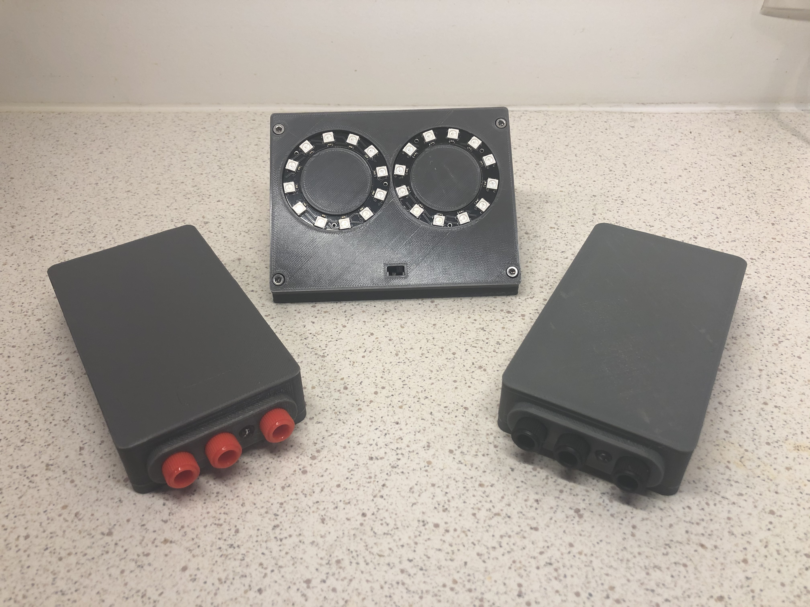

## Wireless System For Fencing (WSFF)





## Overview

WSFF is a wireless scoring system for fencing based on **arduino** and **nrf24l01**.

The goal is to make an **affordable**, **open source** and **open hardware** system.

It currently works for **epee** and **foil**, sabre support is in the roadmap.

This project is divised in two main parts : the **client** and the **server**
- The **client** is the box that each player will use and plug their weapons to
- The **server** is the scoring system, it turn on lights and play sounds if a player hits


## Getting started

To make a system you'll have to go trough these steps:
1. Order the PCB and all the components
2. 3D print the boxes
3. Program the arduino
4. Solder the PCB and assemble everything
5. Enjoy !

I wrote a step by step tutorial that you can find [here](./Instructable/Instructable.md).

If you have a question about anything (please read the tutorial first) you can open a Github issue and I will try my best to answer you.

#### ⚠️ If you don't want to make it yourself I opened an Etsy store to sell fully assembled systems.


## About the directory structure

This repository contains all the **sources**, **3d files** and **pcb files** needed to make this system.

```
.
├── Archive      # some old versions of the project
├── Documents    # pcb sources, and stl files
├── Code         # source code
├── Instructable # step by step tutorial to diy
```
Each directory has it's own README.md to explain this with more details.

## Roadmap

- Move to rechargable 3.7v batteries
- Get rid arduio nano and nrf24L01 make a single pcb containing everything
- Support sabre

## License

All the code, CAD files, PCB files and everything within this repository is licensed under the terms of the [GNU General Public License](./LICENSE).

